# 城市声音分类 Urban Sound Classification
## 使用 Visual Studio Tools for AI 加速数据分析案例开发

## 一、背景
本实验选择了声音分类这一非常流行的研究领域。声音分类在很多场景中都有大模型的应用，例如对音乐的分类可以应用于音乐检索和音乐推荐中；对人声的分类可以应用在身份识别、智能家居中。本实验的背景是城市声音的分类，这是智慧城市非常重要的话题，如果能对城市中随机出现的声音进行正确的分类，那么可以及时对一些突发情况做出预警或采取措施，例如在检测到警笛声后可以自动调整红绿灯为应急车辆提供道路方便、在检测到持续犬吠声后可以及时出动城管予以处理、在检测到工业噪声后可为行政处罚提供证据等等，因此城市声音分类有着非常重要的研究和实用价值。

## 二、开发环境
本实验使用到与`Microsoft Visual Studio`、`VS Tools for AI`等开发组件，涉及到了`TensorFlow`、`NumPy`、`Pandas`、`Sklearn`等框架和库，以及`NVIDIA GPU`驱动，`CUDA`和`cuDNN`等。

详细的环境配置方法见`VS Tools for AI`[官方文档](https://github.com/Microsoft/vs-tools-for-ai/blob/master/docs/zh-hans/docs/prepare-localmachine.md)。

配置好环境后，进入`Microsoft Visual Studio`，本实验使用的是2017版本。点击`文件`、`新建`、`项目`，然后在`AI工具`中选择`通用Python应用程序`，项目名称设置为`urban-sound-classification`，点击`确认`即可创建项目。

后续双击`urban-sound-classification.sln`即可进入项目。


## 三、数据准备

本实验的数据来源于[Analytics Vidhya](https://datahack.analyticsvidhya.com/contest/practice-problem-urban-sound-classification/)。数据包括了十种不同类型的城市声音，如表一所示。本实验的任务即通过对音乐数据的分析对十种类型的城市声音正确地分类。

表一

|声音类型|字段|
|:---:|:---|
|空调机|air_conditioner|
|汽车喇叭|car_horn|
|小孩子玩耍|children_playing|
|犬吠|dog_bark|
|钻孔|drilling|
|发动机怠速|engine_idling|
|枪击|gun_shot|
|手提钻|jackhammer|
|警报|siren|
|街头音乐|street_music|

实验数据可在[此链接](https://drive.google.com/drive/folders/0By0bAi7hOBAFUHVXd1JCN3MwTEU)中下载，本实验使用到了`train.zip`，解压后`Train`文件夹中包含了所有的`wav`音频文件，`train.csv`中记录了每个音频对应的`ID`及其类别。


## 四、数据探索

### 4.1 数据基本描述
首先查看数据的基本描述。本实验使用`librosa`作为音频处理库，首先加载`train.csv`，然后计算每个对应音频的时长，会发现共有`5435`条数据，其中有八种类型的声音总条数大于600，只有gun_shot和car_horn的样本条数较少，因此本数据集完整且较为平衡。一共有4560条音频数据的时长为4秒钟，其余的时长均小于4秒，因此可能需要做部分预处理。

### 4.2 数据可视化
下面将音频表示为波形（即波形幅度包络图），以直观地查看数据。

可视化结果如下所示：
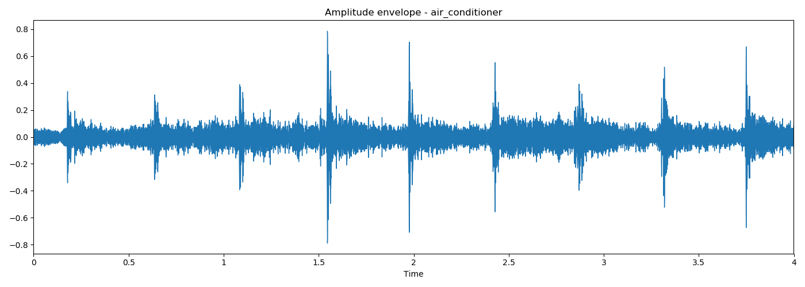
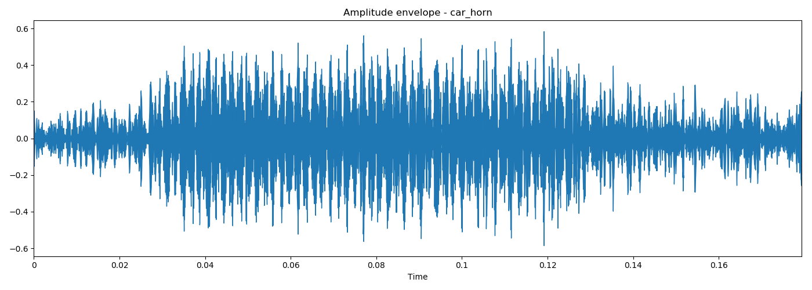
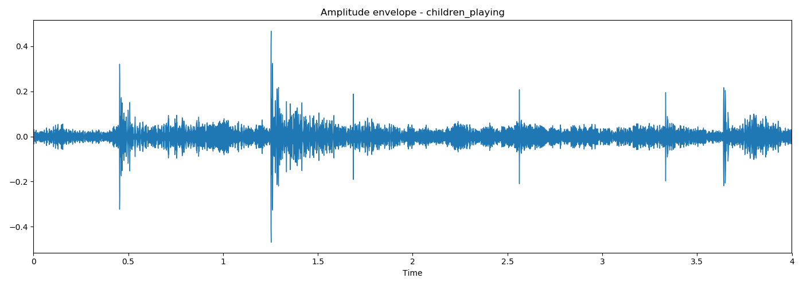
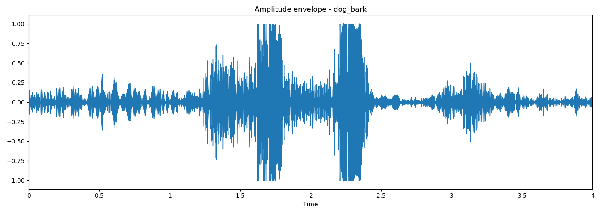
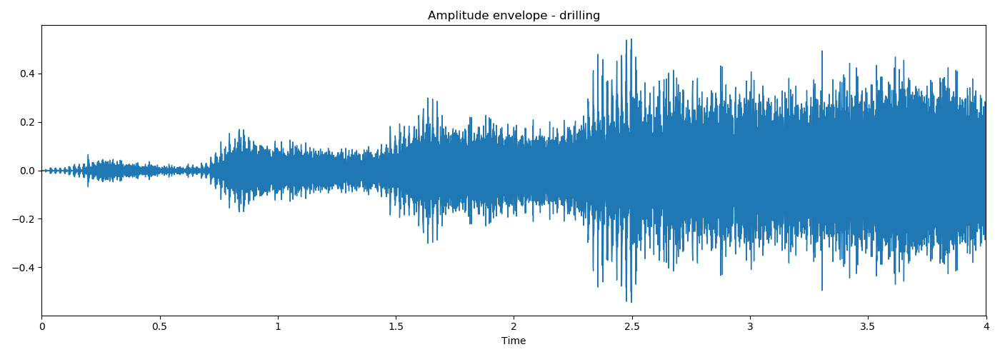

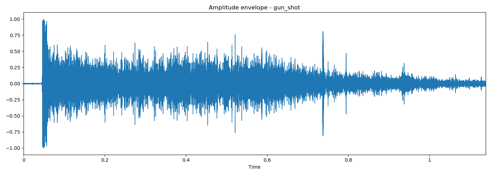
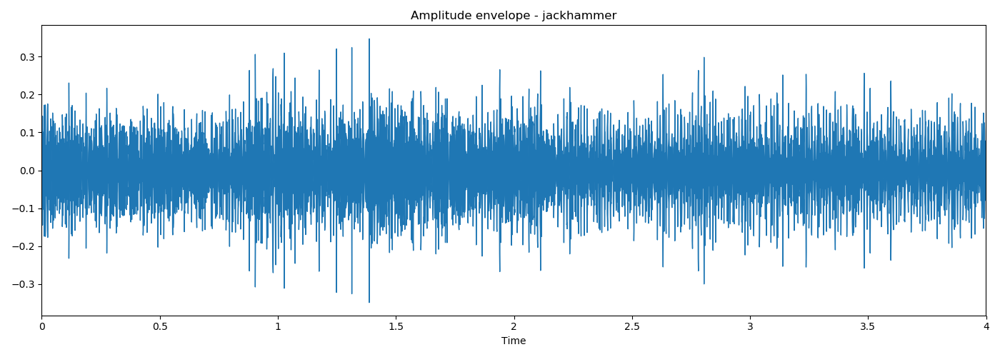
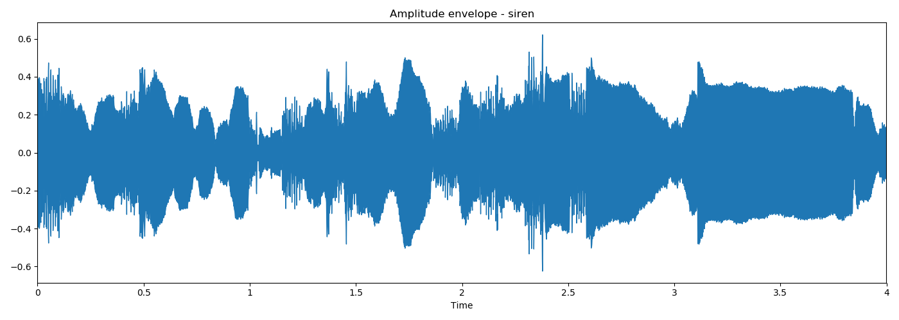
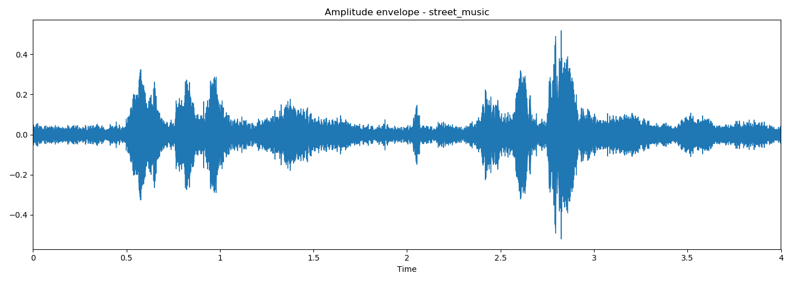

上面可视化的波形是将声音的振幅图形化，只能体现声音的振幅也就是整体音量的大小变化，而声音实际上是各种简单正弦波的叠加，因此下面使用频谱图将声音的频率图形化。

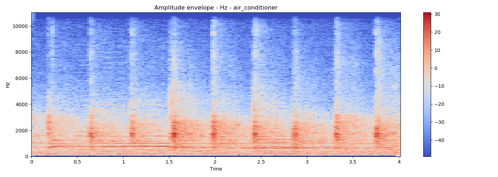
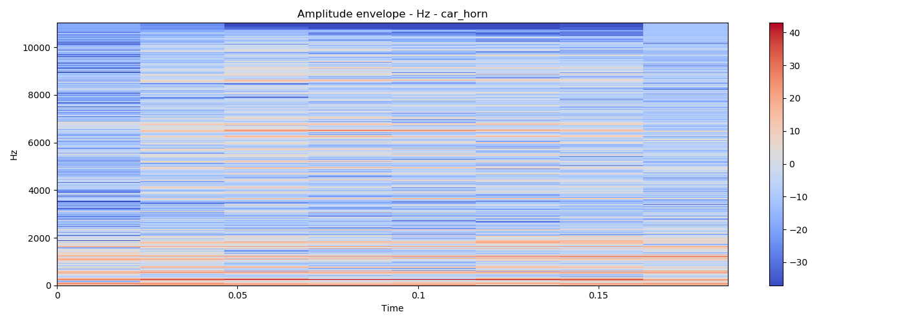
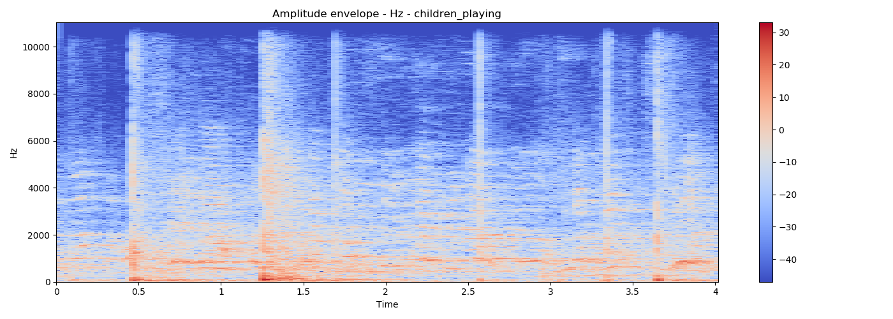
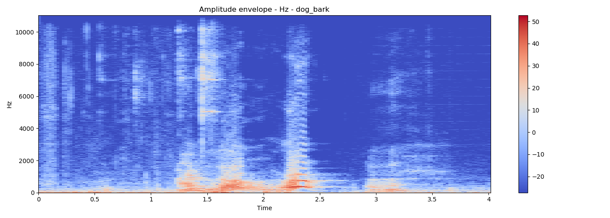
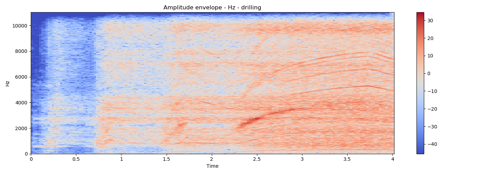

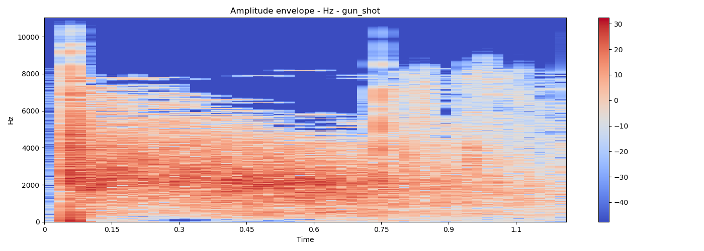
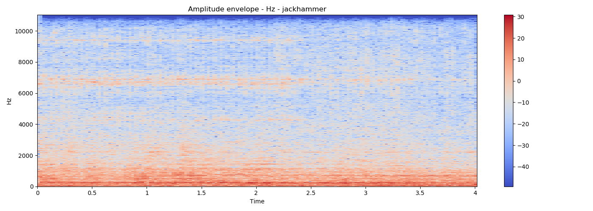
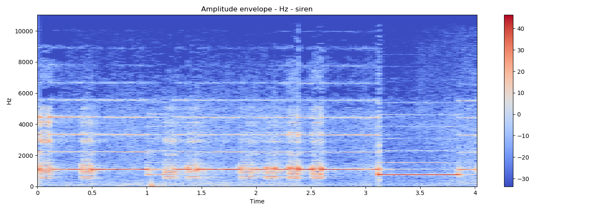
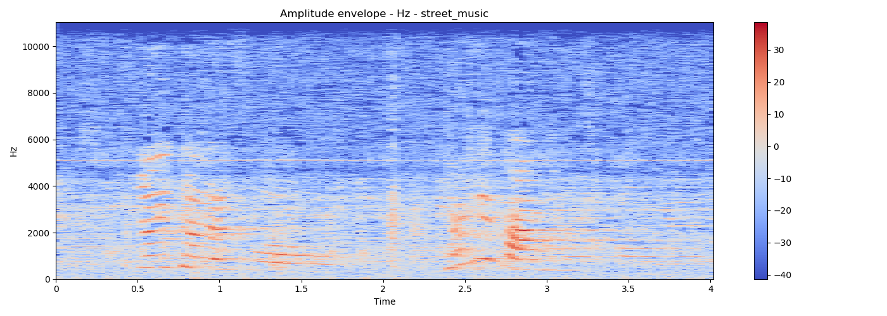

上图实际上是线性频谱图，由于部分声音的频率整体较低，因此还可以是使用对数频谱图将整体拉高一些，以观察在低频声音的信息。观察声音类型为“发动机怠速”的两种频谱图，可以发现线性频谱图低频部分原来被掩盖的信息在对数频谱图中得到了显示。
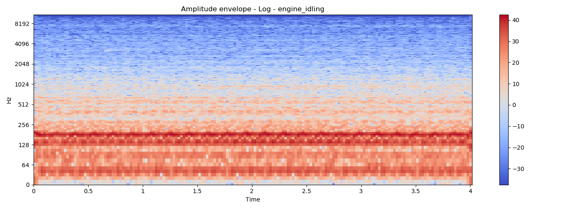

## 五、数据预处理
在上一节的数据探索中，可以发现本实验的数据较为完善且平衡，因此本节预处理将着重在特征工程的处理上。

### 5.1 音频特征
音频是非结构的信息、包含了很多特征，需要根据问题的需要提取相应的特征。实验包括了下列音频特征。
- 过零率（Zero crossing rate）
- 光谱质心（Spectral centroid）
- 色度（Chroma）
- 调性网络（Tonnetz）
- 梅尔频率倒谱系数（MFCC）


### 5.2 MFCC特征提取
实验首先提取MFCC特征。首先读取原始数据种的`csv`文件，该文件中包括了每个`wav`文件的ID和对应的分类标签，代码如下所示：
```python
data_path = 'data'
data = pd.read_csv(os.path.join(data_path, 'train.csv'))

print(data.shape)
```

由于标签值为字符串形式，在深度学习模型中不便于表示，因此这里使用`sklearn`的`LabelEncoder`将字符串转换为数值形式，如下所示:
```python
sound_classes = ['air_conditioner', 'car_horn', 'children_playing', 'dog_bark', 'drilling', 'engine_idling',
                 'gun_shot', 'jackhammer', 'siren', 'street_music']
le = LabelEncoder()
le.fit(sound_classes)
data['label'] = le.transform(data['Class'])
```

对于每一个`wav`文件，首先需要根据其ID读取相应的音频文件，然后使用`librosa`库提取MFCC特征。需要注意的是，由于源文件中各音频长度不等，因此提取出的MFCC特征会有不等的时间步维度。本实验将采取两种方式来处理该问题，第一种是直接对各个时间步的特征值求平均；第二种是将长度较短的特征向量补全到统一的长度。对于补全后的特征矩阵，使用`sklearn.preprocessing.scale`将数据标准化，使得数据无量纲化，避免数据太大引发的数据问题。代码如下所示。
```python
def parse_wav(data):
    n_mfcc = 40
    all_mfcc = np.empty((0, n_mfcc, 173))
    all_mfcc_m = np.empty((0, n_mfcc))
    all_mfcc_scale = np.empty((0, n_mfcc, 173))

    for i, row in data.iterrows():
        id = row[0]
        print(id)

        wav_file = os.path.join(data_path, 'Train', str(id) + '.wav')
        time_series, sampling_rate = librosa.load(wav_file, res_type='kaiser_fast')

        mfcc = librosa.feature.mfcc(y=time_series, sr=sampling_rate, n_mfcc=n_mfcc)
        mfcc_m = np.mean(mfcc, axis=1).T

        if mfcc.shape[1] < 173:
            padding = np.zeros((n_mfcc, 173 - mfcc.shape[1]))
            mfcc = np.concatenate([mfcc, padding], axis=1)

        all_mfcc = np.vstack((all_mfcc, [mfcc]))
        all_mfcc_m = np.vstack((all_mfcc_m, [mfcc_m]))

        mfcc_scale = scale(mfcc)
        all_mfcc_scale = np.vstack((all_mfcc_scale, [mfcc_scale]))

    return all_mfcc, all_mfcc_m, all_mfcc_scale
```

### 5.3 色度特征提取
本小节将对色度特征进行提取，与上节中MFCC提取方法类似，色度特征矩阵因为音频长度不等也会出现维度不一致，因此使用同样的两种方法进行处理。这里同样对补全后的矩阵进行数据标准化操作。核心代码如下所示：
```python
def parse_wav(data):
    all_chroma = np.empty((0, 12, 173))
    all_chroma_m = np.empty((0, 12))
    all_chroma_scale = np.empty((0, 12, 173))

    for i, row in data.iterrows():
        id = row[0]
        print(id)

        wav_file = os.path.join(data_path, 'Train', str(id) + '.wav')
        time_series, sampling_rate = librosa.load(wav_file, res_type='kaiser_fast')

        chroma = librosa.feature.chroma_stft(y=time_series, sr=sampling_rate)
        chroma_m = np.mean(chroma, axis=1).T

        if chroma.shape[1] < 173:
            padding = np.zeros((12, 173 - chroma.shape[1]))
            chroma = np.concatenate([chroma, padding], axis=1)

        all_chroma = np.vstack((all_chroma, [chroma]))
        all_chroma_m = np.vstack((all_chroma_m, [chroma_m]))

        chroma_scale = scale(chroma)
        all_chroma_scale = np.vstack((all_chroma_scale, [chroma_scale]))

    return all_chroma, all_chroma_m, all_chroma_scale
```

### 5.4 混合特征提取
在4.1节中介绍了五种类型的特征，本节将混合五种特征进行提取。本节将MFCC的特征维度减少到20维，以降低对其它特征的影响。因此五种特征的比例为`过零率：光谱质心：色度：调性网络：梅尔频率倒谱系数 = 1 : 1 : 20 : 12 : 6`类似的，使用`sklearn.preprocessing.scale`标准化数据。最后获得了`(batch_size * 40)`的混合特征。核心代码如下所示。
```python
def parse_wav(data):
    all_zrc_m = np.empty((0, 1))
    all_cent_m = np.empty((0, 1))
    all_mfcc_m = np.empty((0, 20))
    all_chroma_m = np.empty((0, 12))
    all_tonnetz_m = np.empty((0, 6))

    for i, row in data.iterrows():
        id = row[0]
        print(id)

        wav_file = os.path.join(data_path, 'Train', str(id) + '.wav')
        time_series, sampling_rate = librosa.load(wav_file, res_type='kaiser_fast')

        zcr = librosa.feature.zero_crossing_rate(time_series)
        cent = librosa.feature.spectral_centroid(y=time_series, sr=sampling_rate)
        mfccs = librosa.feature.mfcc(y=time_series, sr=sampling_rate, n_mfcc=20)
        chroma = librosa.feature.chroma_stft(y=time_series, sr=sampling_rate)
        tonnetz = librosa.feature.tonnetz(y=time_series, sr=sampling_rate)

        zrc_m = np.mean(zcr, axis=1).T
        cent_m = np.mean(cent, axis=1).T
        mfccs_m = np.mean(mfccs, axis=1).T
        chroma_m = np.mean(chroma, axis=1).T
        tonnetz_m = np.mean(tonnetz, axis=1).T

        mfccs_m = scale(mfccs_m)
        chroma_m = scale(chroma_m)
        tonnetz_m = scale(tonnetz_m)

        all_zrc_m = np.vstack((all_zrc_m, [zrc_m]))
        all_cent_m = np.vstack((all_cent_m, [cent_m]))
        all_mfcc_m = np.vstack((all_mfcc_m, [mfccs_m]))
        all_chroma_m = np.vstack((all_chroma_m, [chroma_m]))
        all_tonnetz_m = np.vstack((all_tonnetz_m, [tonnetz_m]))

    return all_zrc_m, all_cent_m, all_mfcc_m, all_chroma_m, all_tonnetz_m


all_zrc_m, all_cent_m, all_mfcc_m, all_chroma_m, all_tonnetz_m = parse_wav(data)
all_zrc_m = scale(all_zrc_m)
all_cent_m = scale(all_cent_m)

features = np.hstack([all_zrc_m, all_cent_m, all_mfcc_m, all_chroma_m, all_tonnetz_m])
y = np.array(data['label'].tolist())

np.savez('npz/feature', features=features, y=y)
```

## 六、构建深度学习模型
本节将构建深度学习模型对城市声音进行分类。实验将使用`TensorFlow`的`Keras` API。

### 6.1 多层感知机（MLP）
本节将构建多层感知器，具体而言是一个四层的神经网络，包括两个隐层，每一隐层将使用`relu`作为激活函数，最后一层使用`softmax`作为激活函数。网络结构代码如下所示：
```python
def mlp(x_train, y_train, x_test, y_test):
    learning_rate = 0.01
    batch_size = 200

    n_input = len(x_train[0])
    n_hidden_1 = 50
    n_hidden_2 = 50
    n_classes = 10

    inputs = tf.keras.Input(shape=(n_input,))

    print(inputs.shape)

    x = tf.keras.layers.Dense(n_hidden_1, activation='relu')(inputs)
    x = tf.keras.layers.Dense(n_hidden_2, activation='relu')(x)
    predictions = tf.keras.layers.Dense(n_classes, activation='softmax')(x)
    model = tf.keras.Model(inputs=inputs, outputs=predictions)

    model.compile(optimizer=tf.train.AdamOptimizer(learning_rate=learning_rate),
                  loss='categorical_crossentropy',
                  metrics=['accuracy'])

    model.fit(x_train, y_train, batch_size=batch_size, epochs=100, validation_data=(x_test, y_test))
```


### 6.2 LSTM与GRU网络
在数据探索和预处理部分，可以看到实验数据有非常明显的时间特征，各种特征提取后的特征向量都是按照时间步加以展开，因此考虑使用添加了时间信息的循环神经网络构建分类模型。

本小节将使用LSTM和GRU网络，核心的网络结构如下所示:
```python
def gru(x_train, y_train, x_test, y_test):
    learning_rate = 0.01
    batch_size = 300

    n_timesteps = len(x_train[0])
    n_feature = len(x_train[0][0])

    inputs = tf.keras.Input(shape=(n_timesteps, n_feature))

    x = tf.keras.layers.CuDNNGRU(50)(inputs)
    predictions = tf.keras.layers.Dense(10, activation='softmax')(x)
    model = tf.keras.Model(inputs=inputs, outputs=predictions)

    model.compile(optimizer=tf.train.AdamOptimizer(learning_rate=learning_rate),
                  loss='categorical_crossentropy',
                  metrics=['accuracy'])

    model.fit(x_train, y_train, batch_size=batch_size, epochs=3000, validation_data=(x_test, y_test))


def lstm(x_train, y_train, x_test, y_test):
    learning_rate = 0.01
    batch_size = 300

    n_timesteps = len(x_train[0])
    n_feature = len(x_train[0][0])

    inputs = tf.keras.Input(shape=(n_timesteps, n_feature))

    x = tf.keras.layers.CuDNNLSTM(50)(inputs)
    predictions = tf.keras.layers.Dense(10, activation='softmax')(x)
    model = tf.keras.Model(inputs=inputs, outputs=predictions)

    model.compile(optimizer=tf.train.AdamOptimizer(learning_rate=learning_rate),
                  loss='categorical_crossentropy',
                  metrics=['accuracy'])

    model.fit(x_train, y_train, batch_size=batch_size, epochs=3000, validation_data=(x_test, y_test))
```

### 6.3 CNN网络
CNN常用于处理图像问题，在本实验中将把CNN应用于特征提取后的特征矩阵上。本节的CNN网络中，首先的卷积层将有32个卷积核，每个卷积核为`3*3`大小；在relu激活之前，使用了`BatchNormalization`批标准化层以增大梯度，使得模型的收敛速度更快；然后连接到max-pooling池化层；紧接着是有64个卷积核的卷积层与max-pooling池化层；最终通过Flatten后，通过两个全连接层获得最后的输出。其网络结构代码如下所示：
```python
def cnn(x_train, y_train, x_test, y_test):
    learning_rate = 0.00001
    batch_size = 100

    inputs = tf.keras.Input(shape=(len(x_train[0]), len(x_train[0][0]), 1))

    x = tf.keras.layers.Conv2D(32, kernel_size=3)(inputs)
    x = tf.keras.layers.BatchNormalization()(x)
    x = tf.keras.layers.Activation('relu')(x)
    x = tf.keras.layers.MaxPooling2D(pool_size=(2, 2))(x)
    x = tf.keras.layers.Dropout(0.2)(x)

    x = tf.keras.layers.Conv2D(64, kernel_size=3)(x)
    x = tf.keras.layers.BatchNormalization()(x)
    x = tf.keras.layers.Activation('relu')(x)
    x = tf.keras.layers.MaxPooling2D(pool_size=(2, 2))(x)
    x = tf.keras.layers.Dropout(0.2)(x)

    x = tf.keras.layers.Flatten()(x)

    x = tf.keras.layers.Dense(1024)(x)
    x = tf.keras.layers.BatchNormalization()(x)
    x = tf.keras.layers.Activation('relu')(x)

    predictions = tf.keras.layers.Dense(10, activation='softmax')(x)
    model = tf.keras.Model(inputs=inputs, outputs=predictions)

    model.compile(optimizer=tf.train.AdamOptimizer(learning_rate=learning_rate),
                  loss='categorical_crossentropy',
                  metrics=['accuracy'])

    model.fit(x_train, y_train, batch_size=batch_size, epochs=100, validation_data=(x_test, y_test))
```

## 七、模型评估
实验对三种类型的特征和四种模型分别进行了评测，在实验中训练集和测试集的比例为`7:3`，进行多次交叉验证实验。

实验分为表2所示的多种实验类型。

|特征类型|网络类型|标记|
|:---:|:---:|:---:|
|MFCC均值|MLP|mfcc_m_mlp|
|Chroma均值|MLP|chroma_m_mlp|
|混合特征|MLP|feature_mlp|
|-|-|-|
|MFCC标准化|LSTM|mfcc_s_lstm|
|MFCC标准化|GRU|mfcc_s_gru|
|Chroma标准化|LSTM|chroma_s_lstm|
|Chroma标准化|GRU|chroma_s_gru|
|-|-|-|
|MFCC标准化|CNN|mfcc_s_cnn|
|Chroma标准化|CNN|chroma_s_cnn|


### 7.1 MLP


对于 `chroma_m_mlp`，当学习率为`0.01`时，迭代训练`1000`次，在训练约200次后，模型在测试集上的分类准确率在0.55--0.6之间震荡，模型的收敛速度和效果不是最佳。修改学习率为0.001，相比0.01的学习率，收敛速度更慢，分类准确率也有所下降。增加学习率到0.1，模型效果仍然不佳。

下图为学习率为0.001时训练准确率变化图
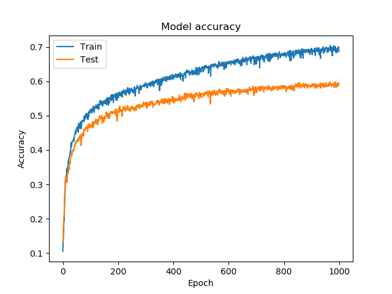 


选择特征为`mfcc_m_mlp`，当学习率为`0.01`时，测试集最佳分类准确率能达到0.81，但是模型震荡较为明显。
降低学习率到`0.001`，测试集最佳准确率有所下降，但模型不再震荡，收敛效果较好；
增加学习率到`0.005`，测试集最佳准确率明显升高，达到0.8939，训练集准确率也接近1.0，模型最快在少于200次迭代时达到最佳，因此模型有较好的表现。
下图为学习率为`0.005`时训练可视化图。
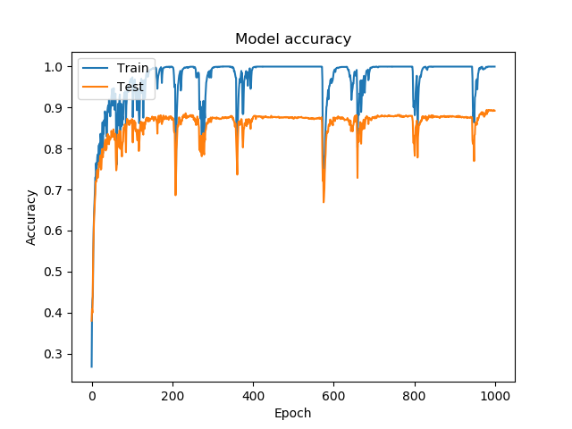 


选择特征为`feature_mlp`，当学习率为`0.01`时,模型在少于200次迭代时便迅速收敛，测试集分类准确率可达到0.7762；
降低学习率至`0.001`，模型收敛速度变慢，但是收敛后的效果相差不大。
增加学习率至`0.005`，模型变化不大。

下图是学习率为`0.01`时训练可视化图。
 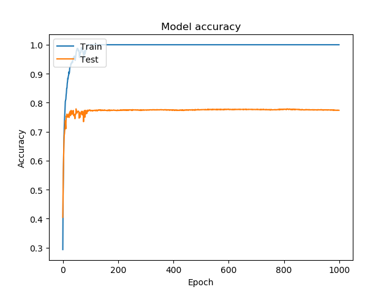 

### 7.2 LSTM & GRU

对于LSTM网络，选定特征为`MFCC`标准化后的值，在学习率为0.1时，模型在测试集上分类准确率能达到0.8952，收敛效果较好，不再做额外调参。
将模型转为GRU，收敛速度和训练速度有所加快，模型效果相差不大。

下图为GRU网络在学习率为0.01时分类准确率的变化图。
 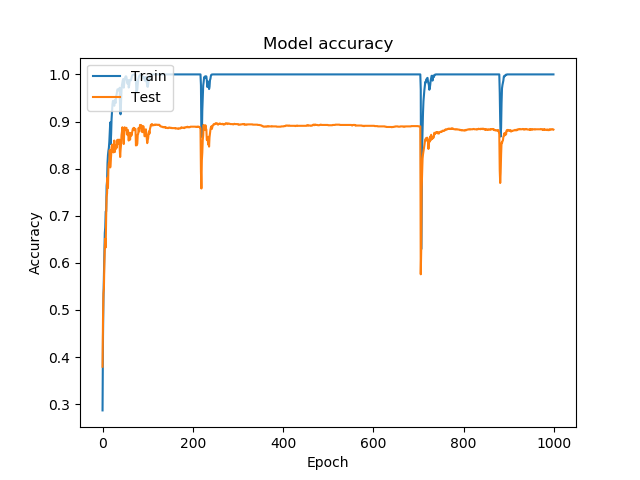 


将特征换为`Chroma`，在LSTM网络下，设定学习率为0.01，模型在测试集上仅能达到0.5212的分类准确率，且模型震荡较为明显；
降低学习率到0.001，模型在测试集的分类准确率有所提升，达到了0.5610。
修改网络为GRU，测试集表现与LSTM相差不大。整体而言，`Chroma`特征下的模型与`MFCC`有较大差距。


### 7.3 CNN

对于CNN网络，首先选定特征为`MFCC`，在学习率为0.01下，模型在测试集的分类准确率能达到0.8817，但是震荡较为明显；
降低学习率到0.001，震荡有明显优化，测试集上分类准确率有略微下降。

修改特征为`Chroma`，在学习率为0.001下，测试集的分类准确率能达到0.6101，相比其它模型有更好的表现。下图是训练过程可视化图。

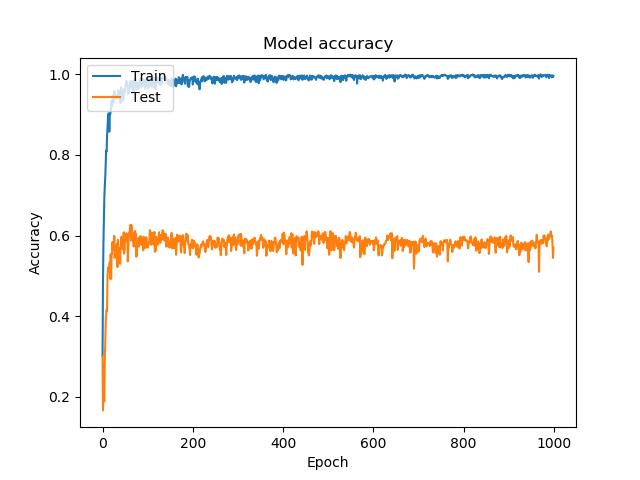 


### 7.4 评估总结
将上述实验结果记录总结后，得到下表。


|标记|参数|训练集分类准确率|测试集分类准确率|
|:---|:---|:---:|:---:|
|mfcc_m_mlp|lr=0.01, batchsize=200|0.9784|0.8136|
|mfcc_m_mlp|lr=0.001, batchsize=200|0.8893|0.7866|
|mfcc_m_mlp|lr=0.005, batchsize=200|0.9997|0.8939|
|feature_mlp|lr=0.01, batchsize=200|1.0|0.7762|
|feature_mlp|lr=0.001, batchsize=200|1.0|0.7676|
|||||
|mfcc_s_lstm|lr=0.01, batchsize=300|1.0|0.8952|
|mfcc_s_gru|lr=0.01, batchsize=300|1.0|0.8964|
|chroma_s_lstm|lr=0.01, batchsize=300|0.9906|0.5212|
|chroma_s_lstm|lr=0.001, batchsize=300|0.9625|0.5610|
|chroma_s_gru|lr=0.01, batchsize=300|1.0|0.5506|
|chroma_s_gru|lr=0.001, batchsize=300|0.9949|0.5567|
|||||
|mfcc_s_cnn|lr=0.01, batchsize=100|0.9984|0.8817|
|mfcc_s_cnn|lr=0.001, batchsize=100|1.0|0.8651|
|chroma_s_cnn|lr=0.001, batchsize=100|1.0|0.6101|

分析实验结果，在多层感知机模型下，`MFCC`能达到最佳的分类准确率，而`Chroma`有明显更差的表现，混合特征在训练集上能达到1.0的分类准确率，但是模型有过拟合的潜在问题。对于RNN类的网络，`MFCC`和`Chroma`特征在测试集上的表现与多层感知机类似；同时注意到GRU网络与LSTM网络模型效果类似，但是GRU网络的训练速度和收敛速度明显好于LSTM网络。对于CNN网络，总体分类准确率更高，`Chroma`特征相比而言模型效果优于MLP和RNN类网络，因此在本实验数据集上CNN有更优秀的建模能力。

## 七、总结
本实验对城市声音数据进行了分析，选择了过零率、光谱质心、色度、调性网络和梅尔频率倒谱系数等多种特征进行特征工程，在`TensorFlow`框架下构建了包括多层感知机、LSTM、GRU和CNN等多种模型，通过大量的实验得到了在测试集上分类准确率接近0.9的模型，有较好的实用价值。
`VS Tools for AI`提供的高效开发、测试、部署功能，加快了实验的开发速度，为数据分析案例的开发提供了新的选择。

---

# 注
详细案例请参考
- 赵卫东著. 机器学习案例实战. 北京：人民邮电出版社，2019（6月左右出版）